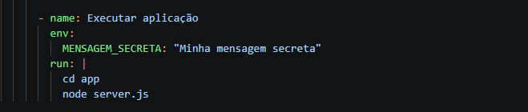
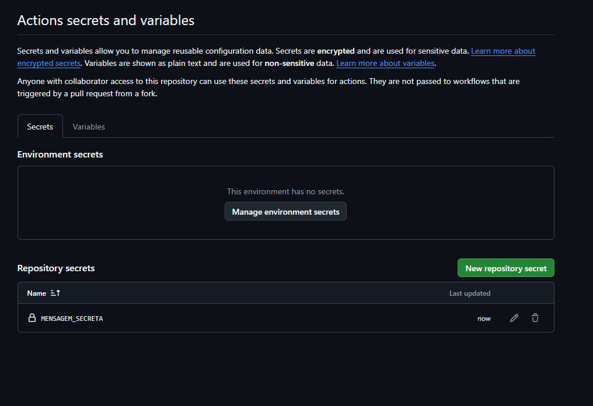
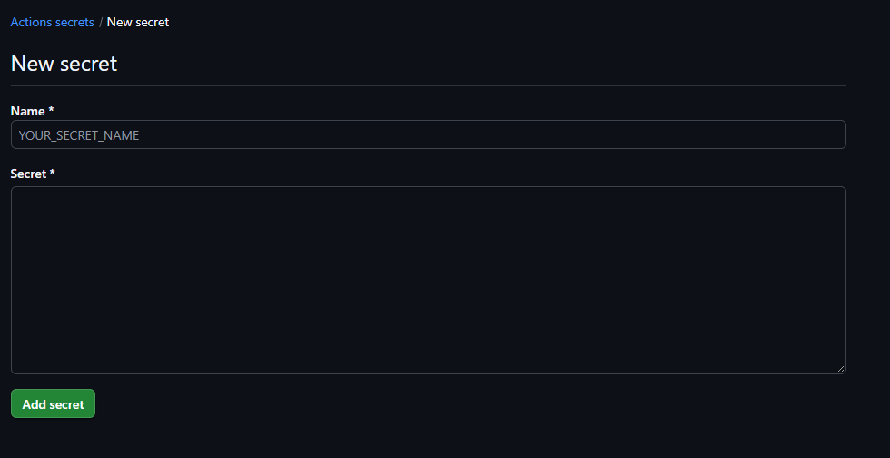
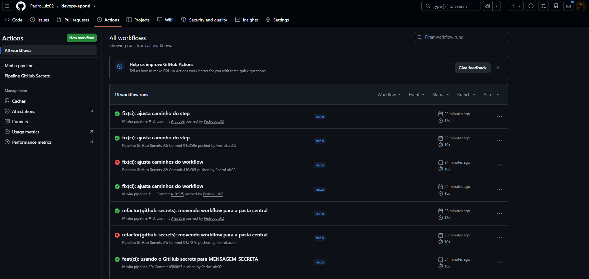
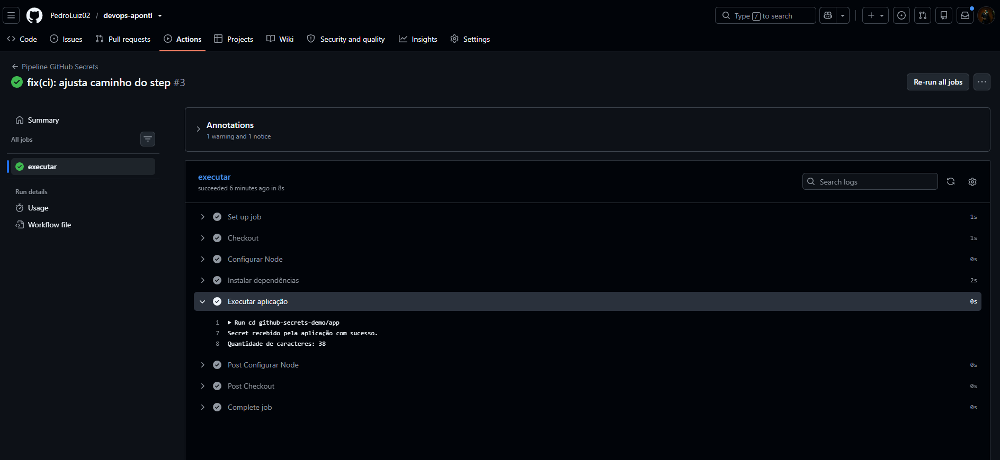

# Atividade Prática — GitHub Secrets

## 1. Problema encontrado

A variável `MENSAGEM_SECRETA` estava definida diretamente no arquivo `pipeline.yml`, no bloco `env:`. Como o workflow é versionado no repositório, o valor ficava exposto no código e no histórico do Git.

## 2. Secret utilizado

`MENSAGEM_SECRETA`

## 3. Como o Secret chegou até a aplicação

O valor do secret fica guardado no GitHub, fora do código. Quando a pipeline roda, o GitHub entrega esse valor para a aplicação.

1. **Guardando o segredo no GitHub**, em Settings > Secrets and variables > Actions > New repository secret, e adicionando o nome `MENSAGEM_SECRETA` e valor do secret.

2. **Na `pipeline.yml`**, em vez de escrever o valor, utilizou-se `${{ secrets.MENSAGEM_SECRETA }}`, que ordena o GitHub a pegar o valor guardado.

3. **Na execução**, a pipeline passa esse valor para a aplicação como a variável de ambiente `MENSAGEM_SECRETA`.

4. **No `server.js`**, a aplicação lê o valor com `process.env.MENSAGEM_SECRETA`.

## 4. Evidências de execução da pipeline

A aplicação recebeu o Secret com sucesso e o log mostra apenas a quantidade de caracteres, sem exibir o valor.

## 5. Respostas das questões

### Situação inicial

**Onde o segredo está armazenado?**
Em texto dentro do arquivo `pipeline.yml`, que é versionado dentro do repositório.

**Quem poderia visualizar essa informação?**
Qualquer pessoa com acesso ao repositório, ao histórico de commits ou a um clone/fork dele.

**Por que essa prática não é recomendada?**
Pois o código-fonte é feito para ser compartilhado e versionado, não para guardar dados confidenciais.

**O que poderia acontecer se fosse uma senha ou token real?**
A credencial seria exposta, permitindo acesso não autorizado a bancos de dados, APIs e serviços, além de vazamento de dados.

### Questões

**1. Qual é a diferença entre armazenar o valor no `pipeline.yml` e no GitHub Secrets?** 
No `pipeline.yml` o valor fica visível para quem acessa o repositório. Enquanto no GitHub Secrets ele fica criptografado e é mascarado nos logs.

**2. Onde o valor do Secret fica configurado?** 
Nas configurações do repositório em: Settings > Secrets and variables > Actions > Repository secrets.

**3. O valor do Secret deve ser colocado no código da aplicação?** 
Não, O código deve saber apenas o nome da variável, nunca o valor.

**4. Qual é a função de `process.env.MENSAGEM_SECRETA`?** 
Acessar o valor da variável `MENSAGEM_SECRETA` enquanto a aplicação está rodando.

**5. Por que utilizar Secrets é importante em uma pipeline de CI/CD?** 
Pois pipelines precisam de credenciais, sejam tokens, senhas ou chaves. Os Secrets permitem usá-las sem expor elas no repositório ou nos logs.

**6. Por que seria inadequado colocar uma senha real de banco de dados no `.yml`?** 
Porque o arquivo seria versionado e se tornando visível a quem tem o acesso do repositório. A senha acabaria exposta e gravada no histórico do Git, comprometendo o banco em casos de vazamento.