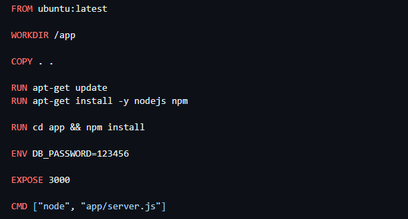
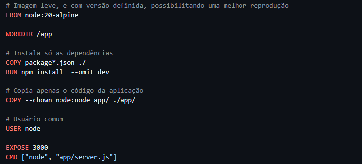
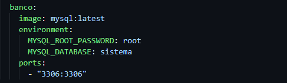
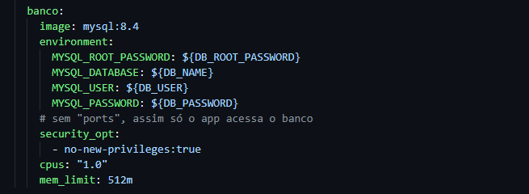
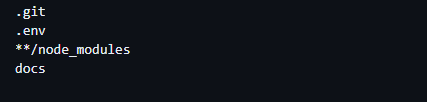

# HARDENING.md — Hardening de Containers

## 1. Problemas encontrados

| O que estava errado | Onde | Qual risco |
| ---------------------|------|-------|
| Imagem `ubuntu:latest` | Dockerfile | Imagem grande, muitos pacotes e sem versão fixa |
| Aplicação como root | Dockerfile | Invasor ganha o acesso administrativo dentro do container |
| `COPY . .` copiando tudo | Dockerfile | Arquivos desnecessários vão para a imagem |
| `ENV DB_PASSWORD` | Dockerfile | O valor da senha fica gravado nas camadas da imagem |
| `MYSQL_ROOT_PASSWORD: root` | docker-compose.yml | Senha fraca, em texto puro e versionada no Git |
| Porta `3306` publicada | docker-compose.yml | Banco acessível de fora do host |
| `mysql:latest` | docker-compose.yml | Versão não fixa |
| Sem limites de CPU e memória | docker-compose.yml | Container pode travar o host |
| Sem `no-new-privileges` | docker-compose.yml | Processo pode ganhar mais privilégios |

## 2. Medidas aplicadas

| Alteração | Objetivo de segurança | Risco reduzido |
|-----------|----------------------|----------------|
| Imagem `node:20-alpine` | Imagem Linux leve e com versão definida | Menos pacotes e menos vulnerabilidades |
| `npm install --omit=dev` e `COPY` só do necessário | Imagem possuindo só o essencial | Menos arquivos e dependências expostas |
| `.dockerignore` | Não copiar `.env`, `.git` e `docs` | Vazamento de dados para a imagem do docker |
| `USER node` | Menor privilégio | Impacto de um invasor no container |
| Variáveis `${...}` no compose + arquivo `.env` | Senhas fora do código e do Dockerfile | Vazamento de senhas |
| `.gitignore` com `.env` | A `.env` não vai para o Git | Secrets versionados |
| `.env.example` sem valores | Documentar as variáveis necessárias | Erros de configuração |
| Removida a porta 3306 do banco | Expor apenas o necessário | Tirando acesso externo ao banco |
| `mysql:8.4` | Versão fixa | Mudança inesperada |
| `cpus` e `mem_limit` | Controle de recursos | Esgotamento de CPU e memória do host |
| `no-new-privileges` | Impedir ganho de privilégios | Escalada de privilégios |

## 3. Análise final

**Qual era o principal risco encontrado?**
Senha em texto junto com a porta do banco exposto.

**Qual alteração foi mais importante? Por quê?**
Guardas as senhas dos arquivos e remover a porta do banco, assim eliminando o fácil caminho de ataque.

**O que poderia acontecer se o container da aplicação fosse comprometido?**
O invasor poderia ler variáveis e senhas e acessar o banco.

**Como o menor privilégio foi aplicado?**
Com `USER node`, `no-new-privileges`, banco sem porta publicada e limites de CPU e memória.

**Por que o `.env` não deve ir para o repositório?**
Porque ele contém senhas e credenciais importantes. Uma vez enviado ao Git, o arquivo fica registrado no histórico mesmo depois de apagado.

**Qual a função do `.env.example`?**
Mostrar quais variáveis o projeto precisa, sem revelar os seus valores reais.

**Como receber verificações de segurança em uma pipeline CI/CD?**
Podemos usar uma pipeline, como o GitHub Actions, que roda sozinha toda vez que alguém envia um código para o repositório. E nela é possível colocar ferramentas que verificam a segurança automaticamente.

**Medidas adicionais em Kubernetes?**
O Kubernetes tem recursos de segurança que reforçam o que já foi feito no Docker, como Secrets, limites de recursos e RBAC.

## 4. Evidências

### 4.1 Dockerfile

**Antes**

- Imagem `ubuntu:latest`, grande e sem versão fixa.
- Senha escrita na imagem (`ENV DB_PASSWORD=123456`).
- Sem `USER`, então roda direto como root.

**Depois**

- Imagem `node:20-alpine`, leve e com versão definida.
- Sem senha no Dockerfile.
- `USER node`, usuário comum.

### 4.2 Serviço do banco (docker-compose.yml)

**Antes**

- `mysql:latest`, sem versão fixa.
- Senha `root` escrita no arquivo.
- Porta 3306 aberta para o host.

**Depois**

- `mysql:8.4`, versão fixa.
- Senhas vindas do `.env`.
- Sem porta publicada, assim só a aplicação acessa o banco.
- Limites de CPU e memória.

### 4.3 Arquivo .dockerignore

**Antes**

- O projeto não tinha `.dockerignore`, então o `COPY . .` copiava tudo para a imagem, inclusive arquivos sensíveis.

**Depois**

- `.env` fica fora da imagem, protegendo as senhas.
- `.git` e `docs` não são copiados, deixando a imagem menor.
- `node_modules` não é copiado, e as dependências são instaladas dentro da imagem.
